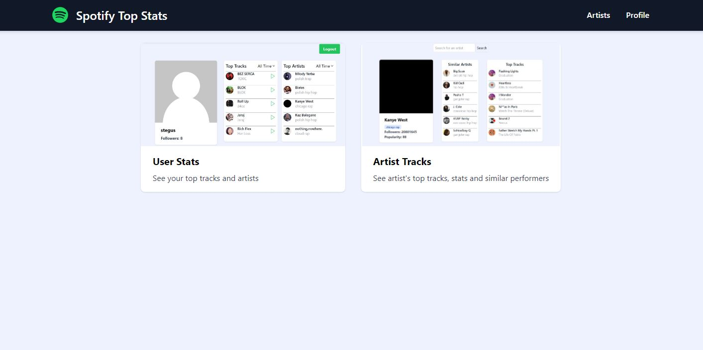

# spotify-api-training

Deployment: https://spotify-top-stats.netlify.app/

## Description
Frontend only application that uses the Spotify API to display a user's or artist's top artists and tracks. The user can select a time range and create a playlist of their top tracks.\

